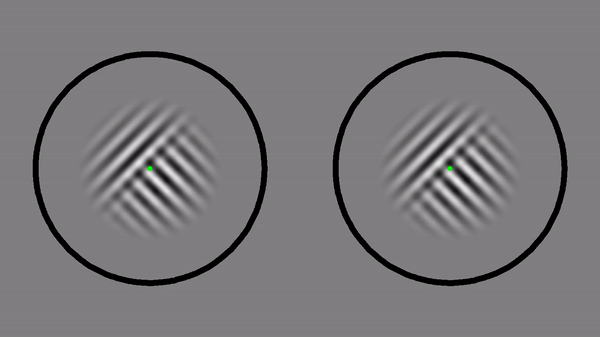

# Pseudo-Binocular Rivalry Project (not completed yet)
This is our repository of our pseudoBinocularRivalry project. The binocular rivalry is one of the most often used phenomenon in cognitive neuroscience to observe conscious perception. Binocular rivalry is the phenomenon where visual perception of images alternates subjects are asked to see one visual image to the right eye and another image to the left eye. In our project, we sought to find its phenomenological characteristics by accessing to introspection of subjects with a phenomenological interview method. We contrasted introspection of the subjects during binocular rivalry stimuli with that with psuedo stimuli.

## Introduction

We referred to the binocular rivalry model by [Li et al., 2018](http://www.pnas.org/content/114/30/E6192). We leveraged an attention model of binocular rivalry stimuli to emulate dynamics of binocular rivalry transistions. Our report sheds light on phenomenological difference between real and peusdo binocular rivalry stimuli.

## Prerequisite
- MATLAB codes from [Li et al., 2018](http://www.pnas.org/content/114/30/E6192).
- 

## Contents
- Generator of Peudo Binocular Rivalry

## Future suggestion

## Committed by
- Dr. Takuya Niikawa, Dr. Katsunori Miyahara, Dr. Hiro Taiyo Hamada, Dr. Satoshi Nishida.

# Support
Our project was supported by KAKENHI.
